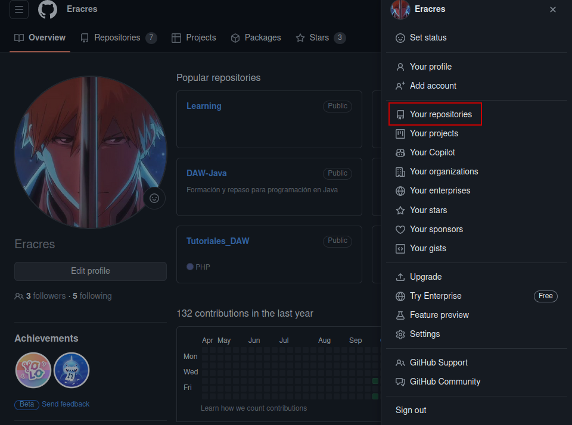
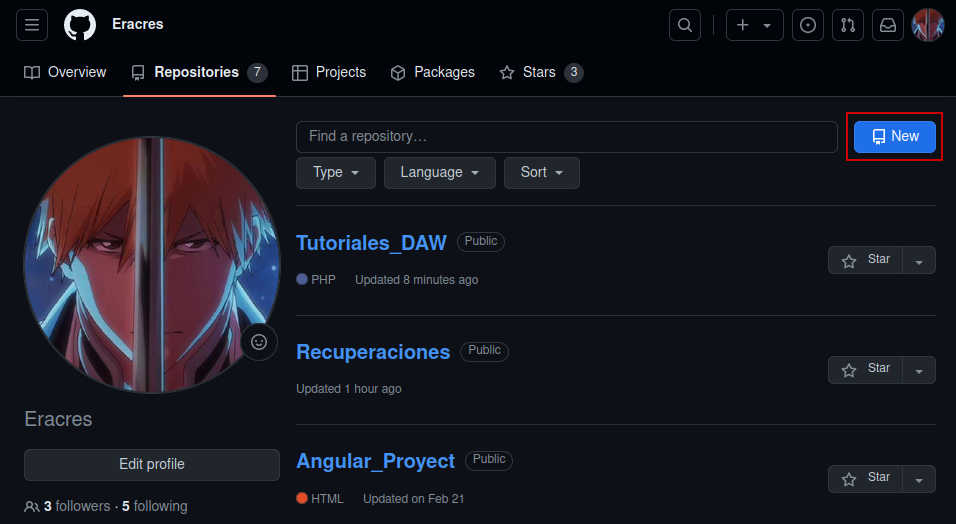

# Git y proyectos GitHub 

En caso de no tener GitHub ni Git debes realizar lo siguiente:

- GitHub: Crear un perfil: https://github.com
- Git: Instalar: https://git-scm.com/ o bien con el comando ``` sudo apt install git ```

Una vez hecho esto seguir los siguientes pasos.

## 1. Configuracion de Git:

Abrir un terminal o linea de comandos y establecer un nombre de usuario y un email:

```
git config --global user.name "Tu Nombre"
git config --global user.email "tu@email.com"
```

## 2. Crear un nuevo repositorio en GitHub

Explicaremos como realizarlo con diferentes imagener:

1. Accedemos a nuestro perfil pulsando nuestro icono en la esquina superior derecha y seleccionamos "Your repositories":  


    
2. Seleccionamos la opción "New" en la parte superior izquierda de nuestro menú de repositorios:



3. Una vez accedamos a la ventana del repositorio, seleccionamos las opciones necesarias para configurarlo:


4. Realizando scroll en la misma ventana, observaremos el botón de "Create" para crear el repositorio:


##

##
