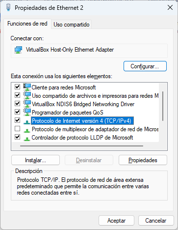
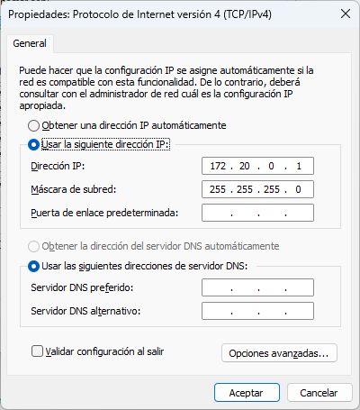

# Crear comunicacion entre maquinas virtuales

Para nuestros ejercicios de desplieque, ya que trabajaremos con Linux, será necesario preparar una conexión entre una 
maquina vitual de Linux Mint, un Ubuntu Server y que estos estén interconectados mediante nuestro sistema operativo
Windows.

## 1. Esquema de la conexión:

Para ello tendremos que configurarlo de la siguiente forma:

[Esquema]()

Las IP's de nuestros equipos corresponderan de la siguiente forma:

Windows       --> 172.20.0.1
Ubuntu Server --> 172.20.0.2
Linux Mint    --> 172.20.0.3

Ahora verificaremos paso a paso la configuración de cada uno de los equipos.

## 2. Configuración de Windows (172.20.0.1)

Inicialmente, tenemos que dar una IP al puerto adecuado para hacer de "host" nuestro ordenador, para ello entramos en la
siguiente ruta:

Panel de control\Redes e Internet\Conexiones de red, donde tiene que aparecer lo siguiente:

Seleccionaremos la opción de VirtualBox que sera con quien hagamos la interconexión, esto dependerá con que sofware cargues 
las máquinas virtuales, pulsaremos el botón derecho del ratón e iremos a "Propiedades" donde nos aparecerá lo siguiente:

  
  Seleccionamos TCP/IPv4
  

