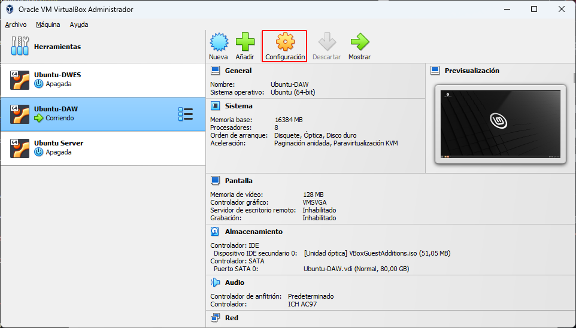
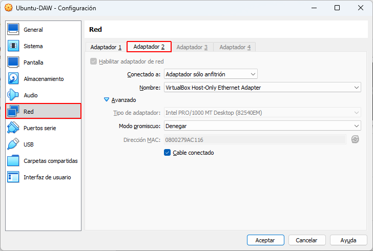

# Crear comunicacion entre maquinas virtuales

Para nuestros ejercicios de desplieque, ya que trabajaremos con Linux, será necesario preparar una conexión entre una 
maquina vitual de Linux Mint, un Ubuntu Server y que estos estén interconectados mediante nuestro sistema operativo
Windows.

## 1. Esquema de la conexión:

Para ello tendremos que configurarlo de la siguiente forma:

[Esquema]()

Las IP's de nuestros equipos corresponderan de la siguiente forma:

 * Windows       --> 172.20.0.1

 * Ubuntu Server --> 172.20.0.2

 * Linux Mint    --> 172.20.0.3

Ahora verificaremos paso a paso la configuración de cada uno de los equipos.

## 2. Configuración de Windows (172.20.0.1)

Inicialmente, tenemos que dar una IP al puerto adecuado para hacer de "host" nuestro ordenador, para ello entramos en la
siguiente ruta:

Panel de control\Redes e Internet\Conexiones de red, donde tiene que aparecer lo siguiente:


Seleccionaremos la opción de VirtualBox que sera con quien hagamos la interconexión, esto dependerá con que sofware cargues 
las máquinas virtuales, pulsaremos el botón derecho del ratón e iremos a "Propiedades" donde nos aparecerá lo siguiente:

<p align="center">
  
  
  
</p>

Seleccionamos la opción TCP/IPv4 y en ella establecemos la IP que le hemos asignado, hecho esto, tendremos configurado la primera parte.

## 3. Configuración de Ubuntu Server (172.20.0.2)

Lo primero de todo debemos configurar con la maquina apagada el adaptador de red, para ello cuando abrimos nuesto 
Oracle VM VirtualBox debemos seleccionar la maquina que configuraremos y pulsar en "Configuración":



Dentro de configuración tenemos que dirigirnos al apartado "Red" donde veremos 4 adaptadores de los cuales solo el 1 estará 
habilitado, por tanto, tendremos que ir al Adaptador 2, habilitarlo y configurarlo de la siguiente forma:



Hecho esto, arrancamos la maquina virtual y asignamos las credenciales para acceder a nuestro Ubuntu Server.

### 1. Instalamos OpenSSH

Una vez accedido al server, tendremos que instalar OpenSSH para realizar nuestra conexión segura, para ello se da este comando:

```
apt install openssh-server
```

### 2. Configuracion de la IP y Netplan

Para ello primero tenemos que verificar las IPs disponibles, para ello accedemos de la siguiente forma a las listas:

```
ip a
```

Identificaremos a enp0s8, y hecho esto, nos dirigiremos a modificar este fichero:

``` 
nano /etc/netplan/00-installer-config.yaml
 ```
En el fichero tenemos que especificar lo que aparece en la imagen (solo variará la IP que tengais):

Para finalizar esta parte tenemos que aplicar las modificaciones del fichero con este comando:

```
netplan apply
```
### 3. Instalación de Apache

Ahora instalaremos Apache con este comando:

```
apt install apache2
```
Una vez instalado, queda configurar nuestra maquina de Linux Mint.

## 4. Configuración de Linux Mint (172.20.0.3)


