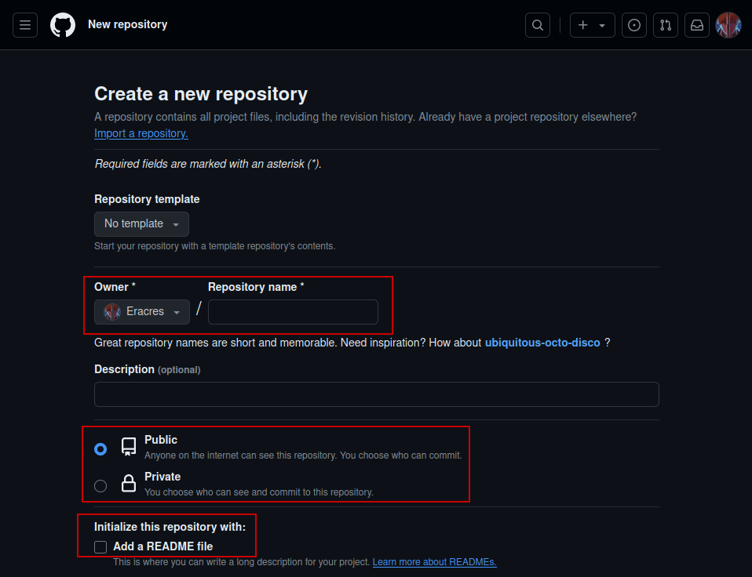

# Git y proyectos GitHub 

En caso de no tener GitHub ni Git debes realizar lo siguiente:

- GitHub: Crear un perfil: https://github.com
- Git: Instalar: https://git-scm.com/ o bien con el comando ``` sudo apt install git ```

Una vez hecho esto seguir los siguientes pasos.

## 1. Configuracion de Git:

Abrir un terminal o linea de comandos y establecer un nombre de usuario y un email:

```
git config --global user.name "Tu Nombre"
git config --global user.email "tu@email.com"
```

## 2. Crear un nuevo repositorio en GitHub

Explicaremos como realizarlo con diferentes imagener:

1. Accedemos a nuestro perfil pulsando nuestro icono en la esquina superior derecha y seleccionamos "Your repositories":  


    
2. Seleccionamos la opción "New" en la parte superior izquierda de nuestro menú de repositorios:


3. Una vez accedamos a la ventana del repositorio, seleccionamos las opciones necesarias para configurarlo:



4. Realizando scroll en la misma ventana, observaremos el botón de "Create" para crear el repositorio:


## 3. Comandos de gestión del proyecto en Git

* Clonar un repositorio 

```git 
git clone <URL_del_repositorio>
```

* Inicializar un repositorio de un directorio

``` git init ```

* Agregar cambios al area de preparacion

Para un archivo en concreto:
``` git add <nombre_del_archivo> ```

Para todo el repositorio:
``` git add . ```

* Confirmar los cambios en el repositorio

``` git commit -m "Mensaje del commit" ```

* Obtener cambios desde el repositorio

 ``` git pull origin <nombre_de_la_rama> ``` 

* Enviar cambios al repositorio

``` git push origin <nombre_de_la_rama> ```
  
* Crear una nueva rama

``` git branch <nombre_de_la_rama> ```

* Cambiar de rama

``` git checkout <nombre_de_la_rama> ```

* Eliminar una rama

``` git branch -d <nombre_de_la_rama> ```

* Ver las ramas del repositorio

``` git branch -a ```

* Fusionar cambios de una rama con el main principal

``` git merge mi_caracteristica ```

##
