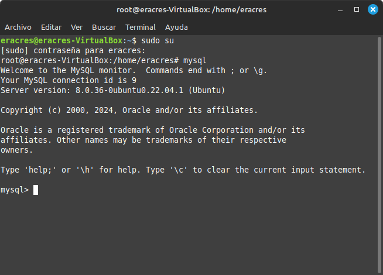
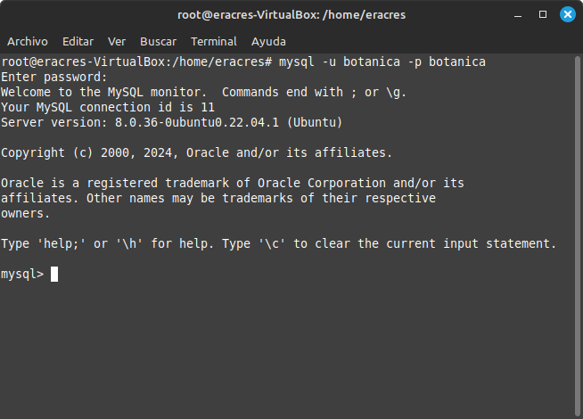
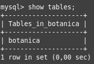
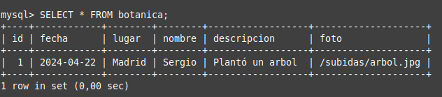

# 1. Conectar a una base de datos

En este tutorial, vamos a aprender a conectar nuestro proyecto PHP a una base de datos que establezcamos nosotros

## 1. Creamos nuestro fichero db.sql

```

```

## 2. Accedemos a Mysql y creamos la BB.DD

Abirmos un Terminal y nos hacemos superusuario:

```
sudo su
```

Seguidamente accedemos a mysql para crear la BB.DD:

```
mysql
```



Una vez dentro de la misma, crearemos nuestra BB.DD, el usuario para la gestion de la misma y los permisos de acceso,
en este caso, vamos a llamar a nuestra BB.DD 'botanica', para evitar que se nos olvide daremos el mismo nombre de usuario
y la misma contraseña, que el nombre de la base de datos:

```
CREATE DATABASE botanica;
CREATE USER 'botanica'@'localhost' INDENTIFIED BY 'botanica';
GRANT ALL ON botanica.* TO 'botanica'@'localhost';
FLUSH PRIVILEGES;
```

Hecho esto, salimos de Mysql y comprobamos si nos permiten acceder desde terminal usando el siguiente codigo:

```
mysql -u botanica -p botanica
```

De estar todo correcto, tendremos esta pantalla:



## 3. Cargamos la BB.DD

En este caso, vamos a introducir nuestro fichero db.sql que creamos en el paso 1 a nuestra BB.DD que acabamos de crear
mediante este comando:

```
mysql -u botanica -p botanica < db.sql
```

Para comprobar que ha funcionado nuestra carga, solo tenemos que volver a acceder a nuestra BB.DD y que muestre nuestra tabla:

### * Acceso a la BB.DD:
    ```
    mysql -u botanica -p botanica 
    ```
### * Mostrar las tablas:
    ```
    show tables;
    ```

 
### * Acceso a la BB.DD:
    ```
    SELECT * FROM botanica; 
    
    ```


## 4. Creamos fichero de enlace a la BB.DD

Para ello creamos un fichero db.php donde tendrá que venir lo siguiente, en nuestro caso para nuestra BB.DD llamada 'botanica':

```
<?php

try {
    $db = new PDO('mysql:host=localhost;dbname=botanica','botanica','botanica');
}catch(PDOException $e){
    echo "ERROR:" . $e->getMessage();
    die();
}

?>
```

## 5. Creamos el index:

Ahora crearemos el index.php de nuestra pagina en el cual, a parte del html basico, necesitamos agregar lo siguiente en PHP:

```
<?php

include('db.php');

$select = $db->prepare("SELECT * FROM botanica");
$select->execute();
$rows = $select->fetchAll(PDO::FETCH_ASSOC);

echo "<pre>";
print_r($rows);
echo "</pre>";

?>
```

## 

NOTA IMPORTANTE: Tener todo instalado correctamente antes:

```
sudo apt.get install php-mysql
```

