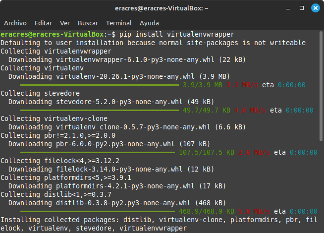

# 1. PRIMER PROYECTO DE DJANGO

En este tutorial vamos ha preparar nuestro entorno de Django y a crear un pequeño proyecto, antes de empezar la programación, tenemos que instalar nuestro entorno, para ello hay que realizar lo siguente:

## 1. Instalar y configurar Virtualenwrapper 

Podeis encontrarlo en su [pagina oficial](https://virtualenvwrapper.readthedocs.io/en/latest/), pero aquí lo sintetizaremos lo más sencillo posible.

  * Lo primero que debemos hacer es instalar Virtualenwrapper, en este caso, esta hecho a través de la Terminal Linux      Mint por lo que el comando es: 
  
    ```
    pip install virtualenvwrapper
    ```
  <p align="center">
    
  </p> 
    
  * Posteriormente, tenemos que realizar los siguiente codigos, creando y exportanto los directorios que nos describe
    el proceso de instalacion:

    ```
    export WORKON_HOME=~/Envs
    ```
    ```
    mkdir -p $WORKON_HOME
    ```
    ```
    source .local/bin/virtualenvwrapper.sh
    ```

    
    
  * Es importante comprobar que los comandos anteriores estén introducidos en el fichero .bashrc, para ello accedemos      al mistmo y lo verificamos:
    
    ```
    nano .bashrc
    ```
    
    
  * Finalmente, creamos nuestro entorno:
    
    ```
    mkvirtualenv entorno
    ```
      

## 2. Instalar y configurar Django

- _**Instalar Django**_

Es momento de instalar Django, para ello y como primer punto lo instalamos en nuestro Terminal:

   ```
   pip install django
   ```

- _**Crear un proyecto nuevo**_ 

A continuación, nos vamos al direcctorio donde queramos crear nuestro proyecto y lo creamos:

   ```
   django-admin startproject Prueba
   ```

- _**Crear una aplicacion en el proyecto**_

Ahora crearemos una aplicación llamada "Chistes":

   ```
   python manage.py startapp Chistes
   ```

- _**Instalar sqlitebrowser*_

Instalamos SQLiteBrowser para manipular BB.DD:

   ```
   sudo apt install sqlitebrowser
   ```

- _**Activar el entorno*_

Habilitaremos nuestro entorno virtual de Django con el siguiente comando:

   ```
   workon entorno
   ```

- _**Migrar cambios del proyecto*_

Ante cualquier modificación de nuestro proyecto, previamente a ejecutar nuestro servidor tenemos que migrar todo mediante este comando:

   ```
   python manage.py migrate
   ```

Para confirmar que se ha hecho correcto nos aparecerá algo así:


- _**Ejecutar Server**_

Finalmente y para comprobar que todo funciona, ejecutarmos el server:

   ```
   python manage.py runserver
   ```
Al poner la IP en nuestro navegador nos tendrá que aparecer lo siguiente, en dicho caso, funcionaria correctamente.

Ahora tenemos que configurar los scripts de nuestro proyecto:

## 3. Configuración del código


