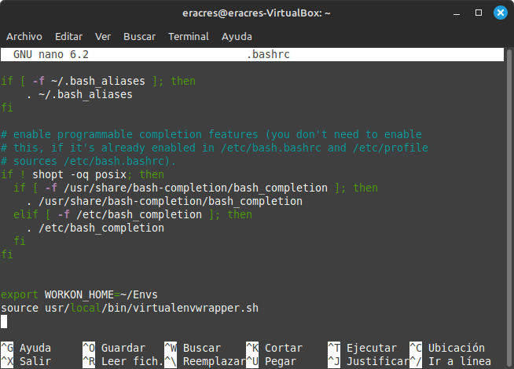

# 1. PRIMER PROYECTO DE DJANGO

En este tutorial vamos ha preparar nuestro entorno de Django y a crear un pequeño proyecto, antes de empezar la programación, tenemos que instalar nuestro entorno, para ello hay que realizar lo siguente:

## 1. Instalar y configurar Virtualenwrapper 

Podeis encontrarlo en su [pagina oficial](https://virtualenvwrapper.readthedocs.io/en/latest/), pero aquí lo sintetizaremos lo más sencillo posible.

  * Lo primero que debemos hacer es instalar Virtualenwrapper, en este caso, esta hecho a través de la Terminal Linux      Mint por lo que el comando es: 
  
    ```
    pip install virtualenvwrapper
    ```
  <p align="center">
    
  </p> 
    
  * Posteriormente, tenemos que realizar los siguiente codigos, creando y exportanto los directorios que nos describe
    el proceso de instalacion:

    ```
    export WORKON_HOME=~/Envs
    ```
    ```
    mkdir -p $WORKON_HOME
    ```
    ```
    source .local/bin/virtualenvwrapper.sh
    ```

  <p align="center">
    
  </p> 
    
  * Es importante comprobar que los comandos anteriores estén introducidos en el fichero .bashrc, para ello accedemos      al mistmo y lo verificamos:
    
    ```
    nano .bashrc
    ```
  <p align="center">
    
  </p> 
  
  * Finalmente, creamos nuestro entorno:
    
    ```
    mkvirtualenv entorno
    ```
  <p align="center">
    
  </p> 

    ### Advertencia
    Para reanudar tu entorno, necesitas realizar lo siguiente.

    Cargar las funciones del entorno mediante este comando:
    ```
    source .local/bin/virtualenvwrapper.sh
    ```

    Ejecutar el entorno:
    ```
    workon (nombre del entorno)
    ```    
  Sabremos que estamos en el entorno cuando nos aparezca el nombre del mismo en nuestra pantalla junto con nuestro usuario de Terminal:
   
  <p align="center">
    
  </p> 

## 2. Instalar y configurar Django

- _**Instalar Django**_

Es momento de instalar Django, para ello y como primer punto lo instalamos en nuestro Terminal:

   ```
   pip install django
   ```
  <p align="center">
    
  </p> 

- _**Crear un proyecto nuevo**_ 

A continuación, nos vamos al direcctorio donde queramos crear nuestro proyecto y lo creamos:

   ```
   django-admin startproject Prueba
   ```
Esta es la estructura que tiene que tener tras crear el proyecto:

  <p align="center">
    
  </p> 
  
- _**Crear una aplicacion en el proyecto**_

Ahora crearemos una aplicación llamada "Chistes":

   ```
   python manage.py startapp Chistes
   ```
Y esta es la estructura despues de crear la aplicación:

  <p align="center">
    
  </p> 

- _**Instalar sqlitebrowser**_

Instalamos SQLiteBrowser para manipular BB.DD:

   ```
   sudo apt install sqlitebrowser
   ```

- _**Activar el entorno**_

Habilitaremos nuestro entorno virtual de Django con el siguiente comando:

   ```
   workon entorno
   ```

- _**Migrar cambios del proyecto**_

Ante cualquier modificación de nuestro proyecto, previamente a ejecutar nuestro servidor tenemos que migrar todo mediante este comando:

   - **Nos muestra las modificaciones pendientes**

   ```
   python manage.py makemigrations
   ```
   - **Nos aplica las modificaciones**

   ```
   python manage.py migrate
   ```
Si no realizamos un ```migrate``` por primera vez, nos aparecerá así

  <p align="center">
   
    
   
  </p> 


Para confirmar que se ha hecho correcto nos aparecerá algo así:


- _**Crear Super-Usuario**_

Para cuando tengamos que acceder al apartado de administrador, tendremos que generarnos un super usuario de la siguiente forma:

   ```
   python manage.py createsuperuser
   ```
   

- _**Ejecutar Server**_

Finalmente y para comprobar que todo funciona, ejecutarmos el server:

   ```
   python manage.py runserver
   ```
Al poner la IP en nuestro navegador nos tendrá que aparecer lo siguiente, en dicho caso, funcionaria correctamente.

Ahora tenemos que configurar los scripts de nuestro proyecto:

## 3. Configuración del código

Una vez terminada la configuración del entorno desde el Terminal de Linux Mint, ahora configuraremos los script mediante Python para ello nos dirigiremos a nuestro IDE, para poder seguir nuestro proyecto de cerca, recordaremos la estructura básica de nuestro proyecto "Pruebas":


- _**Configuracion de models.py**_

 Accedemos a models.py, que se encuentra en la carpeta de la App "Chistes", en el cual añadiremos lo siguiente:

 model.py

   ```python
   from django.db import models

   class Chiste(models.Model):
       titulo = models.TextField(max_length=256)
       cuerpo = models.TextField()
       adultos = models.BooleanField()
       fecha = models.DateField(auto_now=True)
   
       def __str__(self):
           return f'{self.titulo} {self.adultos}'
   ```

- _**Configuracion de admin.py**_

 Accedemos a admin.py, que se encuentra en la carpeta de la App "Chistes", en el cual añadiremos lo siguiente:

 admin.py

   ```python
   from django.contrib import admin
   from .models import Chiste

   admin.site.register(Chiste)
   ```
- _**Configuracion de settings.py**_

 Accedemos a settings.py, que se encuentra en la carpeta de la "Prueba", en el cual localizaremos ```INSTALLED_APPS``` y añadiremos lo siguiente:

 settings.py

   ```python
   INSTALLED_APPS = [
       'Chistes',
       'django.contrib.admin',
       'django.contrib.auth',
       'django.contrib.contenttypes',
       'django.contrib.sessions',
       'django.contrib.messages',
       'django.contrib.staticfiles',
   ]
   ```
 # RECORDATORIO

 **Es importante realizar siempre una migración de los cambios visto anteriormente** 

 ## 4. Acceder al admin

 Hecho todo lo anterior, ahora ejecutamos nuestro server y en la url que nos aparecerá en nuestro navegador que nos aparecerá asi ```http://127.0.0.1:8000/``` le añadiremos /admin/, quedando de la siguiente forma ```http://127.0.0.1:8000/admin/```, pulsando "Enter" aparecerá lo siguiente:

 

 Añadimos las credenciales creadas anteriormente con el comando ```python manage.py createsuperuser``` y nos llevará a la siguiente pagina:

 

# ARBOL INTERACTIVO DEL PROYECTO
```
.
├── [Chistes](Prueba/Chistes)
│   ├── admin.py
│   ├── apps.py
│   ├── __init__.py
│   ├── migrations
│   │   └── __init__.py
│   ├── models.py
│   ├── tests.py
│   └── views.py
├── db.sqlite3
├── manage.py
└── Prueba
    ├── asgi.py
    ├── __init__.py
    ├── __pycache__
    │   ├── __init__.cpython-310.pyc
    │   ├── settings.cpython-310.pyc
    │   ├── urls.cpython-310.pyc
    │   └── wsgi.cpython-310.pyc
    ├── settings.py
    ├── urls.py
    └── wsgi.py
```


